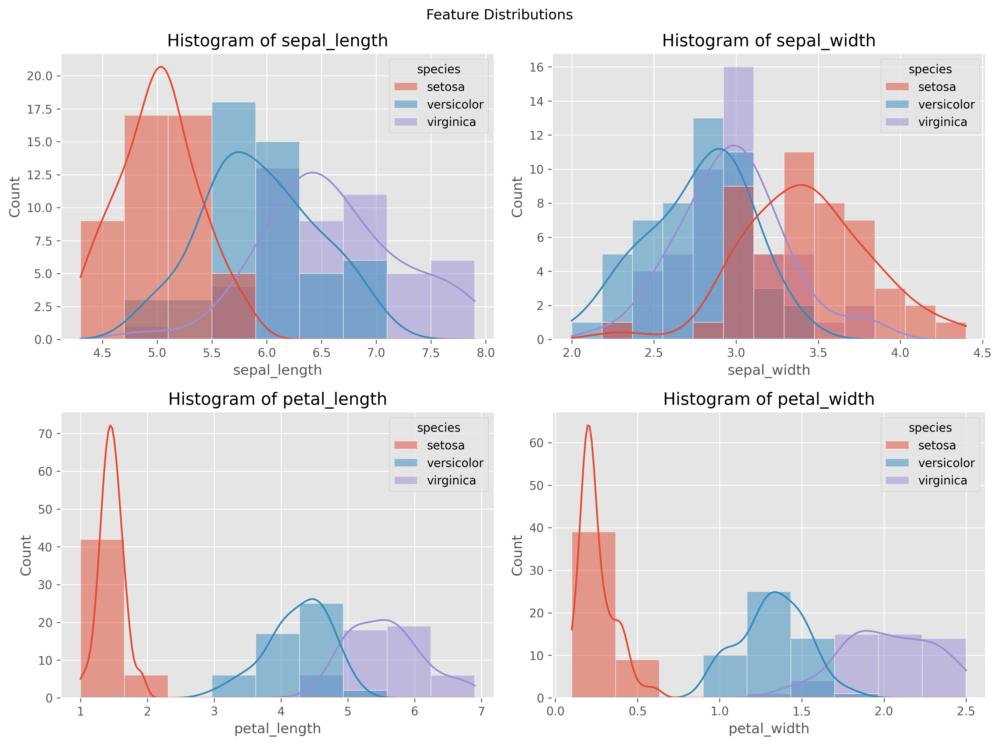
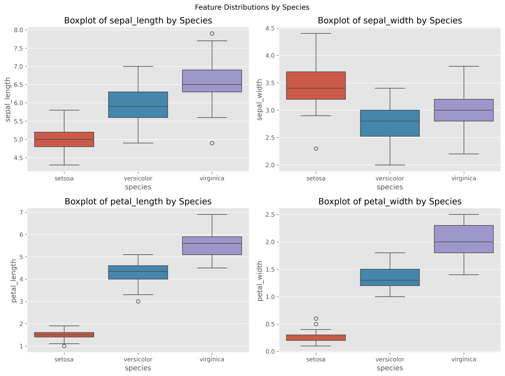
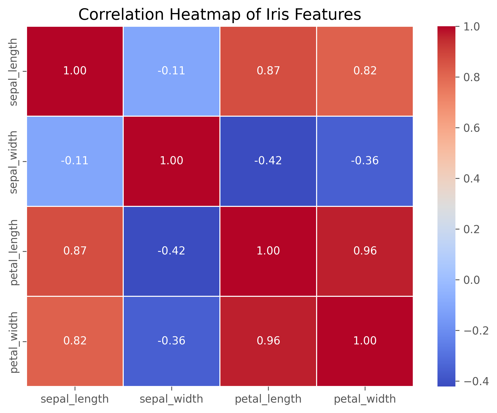
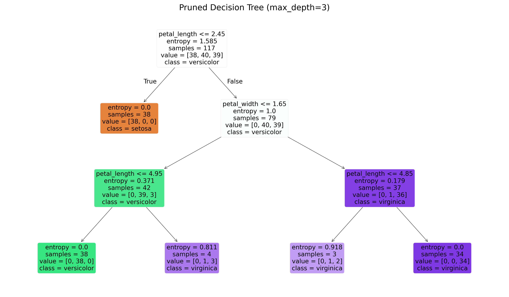
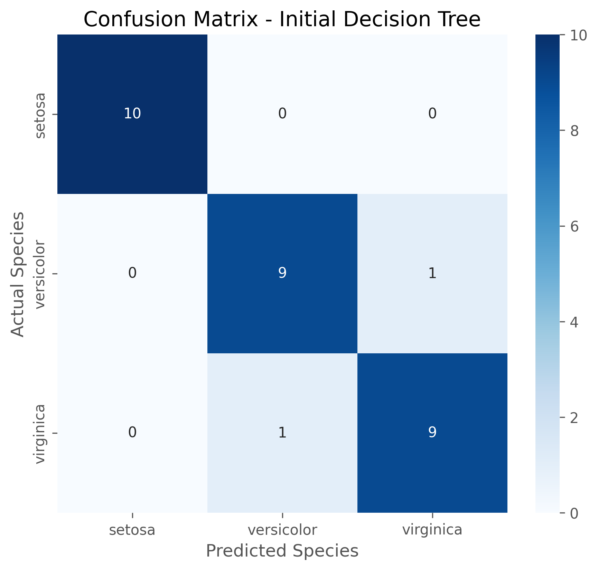
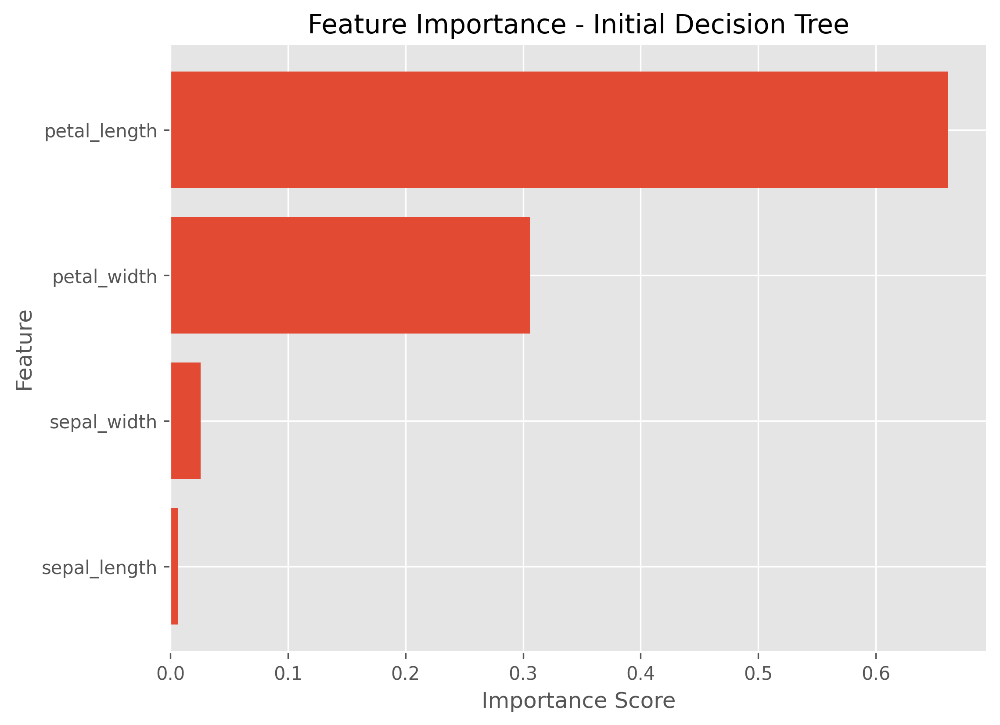

# Level 2 - Task 2: Decision Tree Classification

**Codveda Technologies Machine Learning Internship**

A Decision Tree Classification model built using Scikit-learn to classify Iris flower species and demonstrate how tree pruning improves model performance and generalization.

## Project Overview

This project implements a complete machine learning workflow using the Iris dataset. The notebook covers data exploration, preprocessing, feature analysis, Decision Tree model training, visualization of the decision tree, model evaluation, feature importance analysis, and cost-complexity pruning to reduce overfitting and improve generalization.

**Dataset:** Iris Flower Dataset — 150 samples of Iris flowers with four numerical features (sepal length, sepal width, petal length, and petal width) classified into three species: Setosa, Versicolor, and Virginica.

## Model Architecture

| Component | Description |
|---|---|
| Algorithm | Decision Tree Classifier |
| Criterion | Gini Impurity |
| Train-Test Split | 80% Training / 20% Testing |
| Classes | Setosa, Versicolor, Virginica |
| Features | Sepal Length, Sepal Width, Petal Length, Petal Width |
| Optimization | Cost Complexity Pruning (CCP Alpha) |

The project compares an initial Decision Tree with a pruned version to evaluate improvements in model complexity and predictive performance.

## Results

| Metric | Initial Tree | Pruned Tree |
|---|---:|---:|
| Accuracy | 93.33% | **96.67%** |
| Precision | 93.33% | **96.97%** |
| Recall | 93.33% | **96.67%** |
| F1-Score | 93.33% | **96.66%** |
| Tree Depth | 5 | **3** |
| Nodes | 15 | **9** |

The pruned Decision Tree achieved higher classification performance while reducing tree depth and the number of decision nodes. This demonstrates that pruning simplified the model and improved its ability to generalize to unseen data.

## Visualizations

| | |
|---|---|
|  |  |
|  |  |
|  |  |

## Key Takeaways

- Petal length and petal width were the most influential features for classifying Iris species.
- The Decision Tree correctly separated most flower species with high accuracy.
- Cost Complexity Pruning reduced the tree depth from **5 to 3** while improving overall accuracy.
- A simpler tree is easier to interpret and less likely to overfit the training data.
- Decision Trees are widely used because they provide transparent, explainable predictions without requiring extensive data preprocessing.

## Tools & Libraries

Python · Pandas · NumPy · Matplotlib · Seaborn · Scikit-learn

## How to Run

1. Open `Level2_Task2_Decision_Tree_Classification.ipynb` in Google Colab.
2. Mount Google Drive if prompted.
3. Place the Iris dataset in the specified project directory.
4. Run all notebook cells from top to bottom.
5. Evaluation metrics, visualizations, and model outputs will be generated automatically and saved to the `outputs/` folder.

---

## Author

**Lady Jean Y. Geverola**

BS Data Science  
University of the Philippines Mindanao
